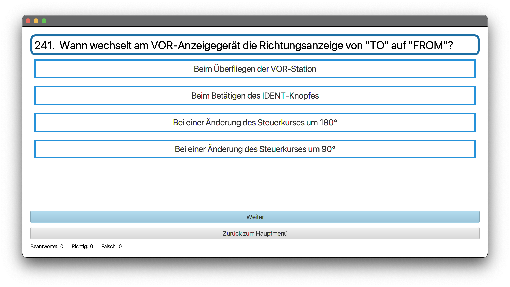
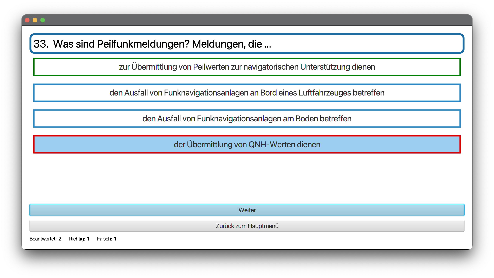

# BZF-Learner

Du bist gerade dabei, dich für deine BZF-Prüfung vorzubereiten und hast es satt, den Fragenkatalog von oben nach unten zu studieren? Dann ist der BZF-Learner die richtige Anwendung für dich. 

Der BZF-Learner ermöglicht es, die von der Bundesnetzagentur zur Verfügung gestellten Fragen abzufragen. Das wichtigste dabei ist, dass nicht immer Antwort A richtig ist, um das Ganze etwas spannender zu gestalten. 

---

## Installation

Um den BZF-Learner zu installieren, wähle aus den Releases den passenden Installer für dein Betriebssystem. Alternativ kannst du auch das Repository auschecken und die Hauptklasse mit einem Java 17 ausführen.

## Einrichtung

Beim ersten Starten der Anwendung bekommst du eine Meldung, dass keine Fragen geladen werden konnten. Um den Fragenkatalog in die Anwendung zu laden benötigst du einmalig die Fragen als PDF von der Bundesnetzagentur. Unter [diesem Link](https://www.bundesnetzagentur.de/DE/Fachthemen/Telekommunikation/Frequenzen/Funkzeugnisse/Flugfunk/start.html) kannst du den Fragenkatalog kostenlos herunterladen. 

Wähle in den Optionen *PDF einlesen...* und suche die heruntergeladene PDF in deinem Dateisystem. Daraufhin sind die Fragen in der Applikation verfügbar und gespeichert.

## Benutzung

1. Wähle im Hauptmenü *Start*

Es begrüßt dich sofort die erste Frage und du kannst loslegen.

2. Wähle die für dich richtige Antwort und klicke auf *Weiter*. Falls deine Antwort richtig war, wird die nächste Frage angezeigt. Falls du die falsche Antwort ausgewählt hast, wird die richtige Antwort grün markiert.

## Known Issues

* Fragen mit Bildern - z.B. ist dort ein Pflichtmeldepunkt oder Bedarfsmeldepunkt abgebildet? - werden in der Anwendung OHNE Bild angezeigt

## Du willst helfen?

Der BZF-Learner wurde mit Java 17 und Maven entwickelt. Um einen Plattformabhängigen Installer zu basteln führe `maven clean package` aus. Um die Applikation in deiner Entwicklungsumgebung zu starten, sollte es ausreichen, wenn du die `BZF-Learner.java` Klasse ausführst.

Ich freue mich auf deinen Pull-Request.

## Credits

<a href="https://www.flaticon.com/free-icons/headset" title="headset icons">Headset icons created by Freepik - Flaticon</a>